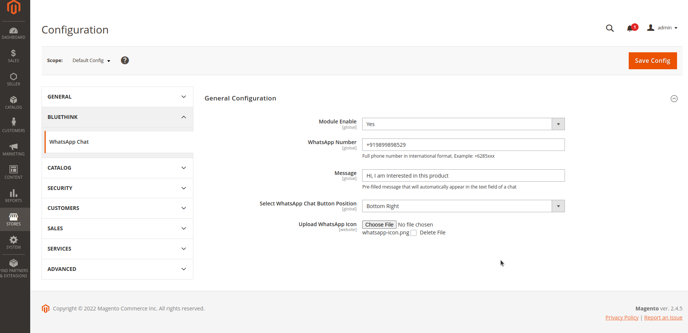
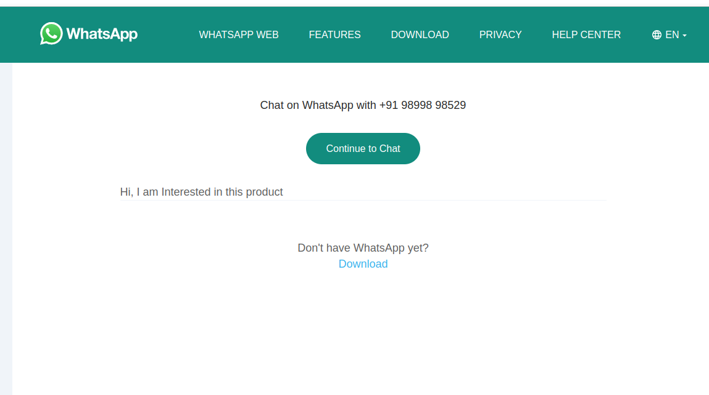
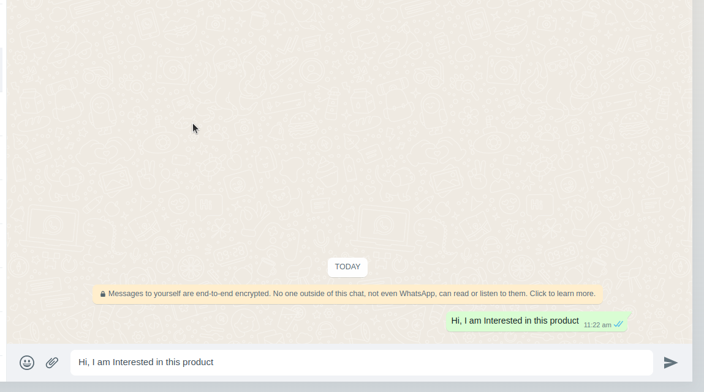

# Module Bluethink whatsapp-button

## Main Functionalities

- This module is used to add whatsapp button on frontend so user can directly communicate with store owner using whatsapp icon.

### Type 1: Zip file

- Enable the module by running `php bin/magento module:enable Bluethinkinc_WhatsAppChat`
- Apply database updates by running `php bin/magento setup:upgrade`
- Compilation by running `php bin/magento setup:di:compile`
- Static content deploy by running `php bin/magento setup:static-content:deploy`
- Flush the cache by running `php bin/magento cache:flush`

## Configuration

- Select from configuration and Save Config.

## Preview

- Whatsapp icon on frontend

- Whatsapp page on frontend

